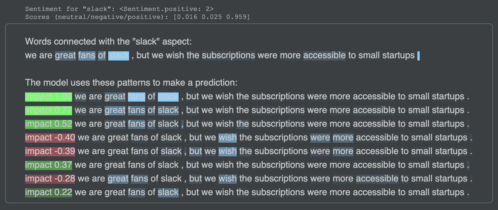

### Aspect Based Sentiment Analysis

The task is to classify the sentiment of potentially long texts for several aspects.
In building this package, we focus on two things.
Firstly, the package works as a service.
It can be freely adjusted and extended to your needs.
It is standalone and scalable.
You just benefit from the fine-tuned State of the Art models.
Secondly, we wish to explain model decisions,
so you can infer how much predictions are reliable.
We desire to provide the robust and stable ML package. 


There are over 100 repositories on GitHub around this problem
<sup>
[1](https://github.com/songyouwei/ABSA-PyTorch)
[2](https://github.com/jimmyyfeng/TD-LSTM)
[3](https://github.com/davidsbatista/Aspect-Based-Sentiment-Analysis)
[4](https://github.com/peace195/aspect-based-sentiment-analysis)
[5](https://github.com/yardstick17/AspectBasedSentimentAnalysis)
[6](https://github.com/thestrox/Aspect-Based-Sentiment-Analysis)
[7](https://github.com/AlexYangLi/ABSA_Keras)
[8](https://github.com/pedrobalage/SemevalAspectBasedSentimentAnalysis)
[9](https://github.com/ganeshjawahar/mem_absa)
</sup>.
All of them are hard to commercialize and reuse open-sourced research projects. 
Their purpose is to turn the evaluation score up. 
It is hard to go through the entire process and reproduce results from scratch. 
The pre/post-processing is divided into stages that makes it hard to use.
Last but not least, there is no/little effort to understand model reasoning.
We try to clean this excellent research up. 
Please give a star if you like the project. 
This is important to keep this project alive.

<br>

### Quick Start

To start, use the fine-tuned model.
The `load` function downloads a model into the package directory, 
sets up the Tensorflow model and returns the ready-to-use pipeline.
The pipeline `nlp` wraps the model and keeps non-differential pre/post-processing needed 
to make a prediction and to interpret results.
Please take a look at the details [here](aspect_based_sentiment_analysis/pipelines.py).

```python
import aspect_based_sentiment_analysis as absa

nlp = absa.load()
text = ("We are great fans of Slack, but we wish the subscriptions "
        "were more accessible to small startups.")

slack, price = nlp(text, aspects=['slack', 'price'])
assert price.sentiment == absa.Sentiment.negative
assert slack.sentiment == absa.Sentiment.positive
```

Now, we wish to infer how much predictions are reliable.
In our task, we are curious about two things at most. 
Firstly, we want to be sure that the model connects the correct
word or words with the aspect. If the model does it wrong, the sentiment
concerns the different entity. Secondly, even if the model recognized
the aspect correctly, we need to understand the model reasoning better.
To do so, we wish to discovers patterns, a weighted sequence
of words, and their approximated impact to the prediction. We want to
avoid a situation wherein a single word or weird word combination
triggers the model. 

```jupyter
# Verify the model decision
html = absa.probing.explain(slack)
display(html)
```

<p align="middle">

</p>

Here, we have two things.
Firstly, we see the model's definition of the "slack" aspect.
The model pays attention to the word "slack" correctly.
Nonetheless, we need to understand that
the sentiment rather concerns the whole collocation "great fans of slack".
Secondly, we go through patterns that impact on a prediction.
We can cluster patterns into two groups.
The patterns in the first group (marked as green) support a decision 
(in this case, push towards the positive sentiment).
Basically, they represent different combinations of weighted words: great, fans, slack.
The patterns in the second group (marked as red) disagree with a decision.
Interestingly, the model recognizes the complex structure like "wish ... more".
Please note that this analysis is a rough approximation.
Take a look at the details [here](aspect_based_sentiment_analysis/probing/recognizers.py).

<br>

### Ready-to-Use Models

In the table, we present the state of the art results on the most common evaluation dataset 
(SemEval 2014 Task 4 SubTask 2, details [here](http://alt.qcri.org/semeval2014/task4/)).
The project assumption is to use the published architectures
(even if I was tempted to do my own).
We recommend `bert-ada` for its simplicity (default).
Take a look at the our model implementation details [here](aspect_based_sentiment_analysis/models.py).

| Model Name | Acc Rest | Acc Lapt | Release |
| :--- |  :---:  |  :---:  | :---: |
||
| LCF-ATEPC  [[code]](https://github.com/yangheng95/LCF-ATEPC)[[paper]](http://arxiv.org/abs/1912.07976)                        | 90.18  |  82.29  | Jan 2020 |
| BERT-ADA   [[code]](https://github.com/deepopinion/domain-adapted-atsc)[[paper]](http://arxiv.org/abs/1908.11860)             | 87.89  |  80.23  | Nov 2019 |
| BAT        [[code]](https://github.com/akkarimi/Adversarial-Training-for-ABSA)[[paper]](https://arxiv.org/pdf/2001.11316.pdf) | 86.03  |  79.35  | Feb 2020 |
||
| `bert-ada-rest-0.1` | 86.51 |
| `bert-ada-lapt-0.1` | | 80.23

There are two available models for the restaurant and laptop domains.
The hyper-parameters optimization with the explanation how to train a model is [here](examples/train_classifier.py).
You can easily reproduce our evaluations.
Look at the performance tests [here](tests/test_performance.py).

<br>

### Installation

You can use the pip:
```bash
pip install aspect-based-sentiment-analysis
```
Otherwise, clone the code and create the new environment via 
[conda](https://docs.conda.io/projects/conda/en/latest/user-guide/tasks/manage-environments.html#):
```bash
git clone git@github.com:ScalaConsultants/Aspect-Based-Sentiment-Analysis.git
conda env create -f=environment.yml
conda activate Aspect-Based-Sentiment-Analysis
```

<br>

### Further Research

Even the task is narrow and well-defined, there is still massive work to do.
Below we present our few open research issues.
We encourage you to help us to improve this package.

- Provide a concrete confidence measure.
- Build the separated model which correlates patterns and linguistics dependencies.
- Process several aspects at once.
- Adapt models across different domains. 
- Proper model calibrations (neutral).
- Robust evaluations (adversarial attacks).
- Distill the model (compress the tuned model).
- More interactive visualization tools.

<br>

### References

How to use BERT for the Aspect-Based Sentiment Analysis:
- Utilizing BERT for Aspect-Based Sentiment Analysis via Constructing Auxiliary Sentence (NAACL 2019)
[[code]](https://github.com/HSLCY/ABSA-BERT-pair)[[paper]](https://www.aclweb.org/anthology/N19-1035/)
- BERT Post-Training for Review Reading Comprehension and Aspect-based Sentiment Analysis (NAACL 2019)
[[code]](https://github.com/howardhsu/BERT-for-RRC-ABSA)[[paper]](http://arxiv.org/abs/1908.11860)
- Exploiting BERT for End-to-End Aspect-based Sentiment Analysis
[[code]](https://github.com/lixin4ever/BERT-E2E-ABSA)[[paper]](http://arxiv.org/abs/1910.00883)

Introduction to the BERT interpretability:
- Are Sixteen Heads Really Better than One?
[[code]](https://github.com/pmichel31415/are-16-heads-really-better-than-1)[[paper]](http://arxiv.org/abs/1905.10650)
- A Primer in BERTology: What we know about how BERT works
[[paper]](http://arxiv.org/abs/2002.12327)
- What Does BERT Look At? An Analysis of BERT's Attention
[[code]](https://github.com/clarkkev/attention-analysis)[[paper]](http://arxiv.org/abs/1906.04341)
- Visualizing and Measuring the Geometry of BERT
[[code]](https://github.com/PAIR-code/interpretability)[[paper]](http://arxiv.org/abs/1906.02715)
- Is BERT Really Robust? A Strong Baseline for Natural Language Attack on Text Classification and Entailment
[[paper]](http://arxiv.org/abs/1907.11932)
- Adversarial Training for Aspect-Based Sentiment Analysis with BERT
[[paper]](http://arxiv.org/abs/2001.11316)
- Adv-BERT: BERT is not robust on misspellings! Generating nature adversarial samples on BERT
[[paper]](http://arxiv.org/abs/2003.04985)
- exBERT: A Visual Analysis Tool to Explore Learned Representations in Transformers Models
[[code]](https://github.com/bhoov/exbert)[[paper]](http://arxiv.org/abs/1910.05276)
- Does BERT Make Any Sense? Interpretable Word Sense Disambiguation with Contextualized Embeddings
[[code]](https://github.com/uhh-lt/bert-sense)[[paper]](http://arxiv.org/abs/1909.10430)
- Attention is not Explanation
[[code]](https://github.com/successar/AttentionExplanation)[[paper]](https://arxiv.org/abs/1902.10186)
- Attention is not not Explanation
[[code]](https://github.com/sarahwie/attention)[[paper]](http://arxiv.org/abs/1908.04626)[[blog post]](https://medium.com/@yuvalpinter/attention-is-not-not-explanation-dbc25b534017)
- Hierarchical interpretations for neural network predictions
[[code]](https://github.com/csinva/hierarchical-dnn-interpretations)[[paper]](https://arxiv.org/abs/1806.05337)
- Analysis Methods in Neural NLP
[[code]](https://github.com/boknilev/nlp-analysis-methods)[[paper]](https://www.mitpressjournals.org/doi/pdf/10.1162/tacl_a_00254)
- Visualization for Sequential Neural Networks with Attention
[[code]](https://github.com/HendrikStrobelt/Seq2Seq-Vis)
- NeuroX: Toolkit for finding and analyzing important neurons in neural networks
[[code]](https://github.com/fdalvi/NeuroX)[[paper]](https://arxiv.org/abs/1812.09359)

The State of the Art results:
- A Multi-task Learning Model for Chinese-oriented Aspect Polarity Classification and Aspect Term Extraction
[[code]](https://github.com/yangheng95/LCF-ATEPC)[[paper]](http://arxiv.org/abs/1912.07976)
- Adapt or Get Left Behind: Domain Adaptation through BERT Language Model Finetuning for Aspect-Target Sentiment Classification
[[code]](https://github.com/deepopinion/domain-adapted-atsc)[[paper]](http://arxiv.org/abs/1908.11860)
- Adversarial Training for Aspect-Based Sentiment Analysis with BERT
[[code]](https://github.com/akkarimi/Adversarial-Training-for-ABSA)[[paper]](https://arxiv.org/pdf/2001.11316.pdf)

Other interesting:
- Multi-Dimensional Explanation of Ratings from Reviews
[[paper]](http://arxiv.org/abs/1909.11386)
- Extracting Syntactic Trees from Transformer Encoder Self-Attentions
[[paper]](http://aclweb.org/anthology/W18-5444)
- Master Thesis: Transfer and Multitask Learning for Aspect-Based Sentiment Analysis Using the Google Transformer Architecture
[[code]](https://github.com/felixSchober/ABSA-Transformer)
- Create interactive textual heat maps for Jupiter notebooks
[[code]](https://github.com/AndreasMadsen/python-textualheatmap)
- A pyTorch implementation of the DeepMoji model: state-of-the-art deep learning model for analyzing sentiment, emotion, sarcasm etc
[[code]](https://github.com/huggingface/torchMoji)
- More you can find [here](https://github.com/jiangqn/Aspect-Based-Sentiment-Analysis).
