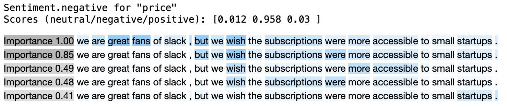

### Aspect Based Sentiment Analysis

The task is to classify the sentiment of potentially long texts for several aspects.
The key idea is to build a modern NLP package which supports explanations of model predictions.
The approximated decision explanations help you to infer how reliable predictions are.
The package is standalone, scalable, and can be freely extended to your needs.
We sum up thoughts in the article:
<br>

**Do You Trust in Aspect-Based Sentiment Analysis? Testing and Explaining Model Behaviors**
(will be published soon).
<br>

There are over 100 repositories on GitHub around sentiment analysis 
<sup>
[1](https://github.com/songyouwei/ABSA-PyTorch)
[2](https://github.com/jimmyyfeng/TD-LSTM)
[3](https://github.com/davidsbatista/Aspect-Based-Sentiment-Analysis)
[4](https://github.com/peace195/aspect-based-sentiment-analysis)
[5](https://github.com/yardstick17/AspectBasedSentimentAnalysis)
[6](https://github.com/thestrox/Aspect-Based-Sentiment-Analysis)
[7](https://github.com/AlexYangLi/ABSA_Keras)
[8](https://github.com/pedrobalage/SemevalAspectBasedSentimentAnalysis)
[9](https://github.com/ganeshjawahar/mem_absa)
</sup>.
All of them are hard to commercialize and reuse open-source research projects.
We clean up this excellent research. 
Please give a star if you like the project. 
This is important to keep this project alive.

<br>

### Quick Start

The aim is to classify the sentiments of a text concerning given aspects. 
We have made several assumptions to make the service more helpful. 
Namely, the text being processed might be a full-length document, 
the aspects could contain several words (so may be defined more precisely), 
and most importantly, the service should provide an approximate explanation of any decision made, 
therefore, a user will be able to immediately infer the reliability of a prediction.

```python
import aspect_based_sentiment_analysis as absa

nlp = absa.load()
text = ("We are great fans of Slack, but we wish the subscriptions "
        "were more accessible to small startups.")

slack, price = nlp(text, aspects=['slack', 'price'])
assert price.sentiment == absa.Sentiment.negative
assert slack.sentiment == absa.Sentiment.positive
```

Above is an example of how quickly you can start to benefit from our open-source package. 
All you need to do is to call the `load` function which sets up the ready-to-use pipeline `nlp`. 
You can explicitly pass the model name you wish to use (a list of available models is below), or a path to your model. 
In spite of the simplicity of using fine-tune models, we encourage you to build a custom model which reflects your data. 
The predictions will be more accurate and stable. 

<br>

### Pipeline: Keeping the Process in Shape

The pipeline provides an easy-to-use interface for making predictions.
Even a highly accurate model will be useless if it is unclear how to correctly prepare the inputs and how to interpret the outputs.
To make things clear, we have introduced a pipeline that is closely linked to a model.
It is worth to know how to deal with the whole process, especially if you plan to build a custom model.


<p align="middle">

</p>


The diagram above illustrates an overview of the pipeline stages.
As usual, at the very beginning, we pre-process the inputs.
We convert the text and the aspects into a `task` which keeps examples (pairs of a text and an aspect) that we can then further tokenize, encode and pass to the model.
The model makes a prediction, and here is a change.
Instead of directly post-processing the model outputs, we have added a review process wherein 
the independent component called the `professor` supervises and explains a model prediction.
The professor might dismiss a model prediction if the model internal states or outputs seem suspicious.
In the article [here], we discuss in detail how the model and the professor work.

````python
import aspect_based_sentiment_analysis as absa

name = 'absa/classifier-rest-0.2'
model = absa.BertABSClassifier.from_pretrained(name)
tokenizer = absa.BertTokenizer.from_pretrained(name)
professor = absa.Professor(...)     # Explained in detail later on.
text_splitter = absa.sentencizer()  # The English CNN model from SpaCy.
nlp = absa.Pipeline(model, tokenizer, professor, text_splitter)

# Break down the pipeline `call` method.
task = nlp.preprocess(text=..., aspects=...)
tokenized_examples = nlp.tokenize(task.examples)
input_batch = nlp.encode(tokenized_examples)
output_batch = nlp.predict(input_batch)
predictions = nlp.review(tokenized_examples, output_batch)
completed_task = nlp.postprocess(task, predictions)
````

Above is an example how to initialize the pipeline directly,
and we revise in code the process being discussed by exposing what calling the pipeline does under the hood.
We have omitted a lot of insignificant details but there's one thing we would like to highlight.
The sentiment of long texts tends to be fuzzy and neutral. 
Therefore, you might want to split a text into smaller independent chunks, sometimes called spans. 
These could include just a single sentence or several sentences.
It depends on how the `text_splitter` works. 
In this case, we are using the SpaCy CNN model, which splits a document into single sentences, 
and, as a result each sentence can then be processed independently.
Note that longer spans have richer context information, so a model will have more information to consider.
Please take a look at the pipeline details [here](aspect_based_sentiment_analysis/pipelines.py).

<br>

### Supervising Model Predictions

It's time to explain model reasoning, something which is extremely hard.
The key concept is to frame the problem of explaining a model decision as an independent task wherein
an aux. model, the `pattern recognizer`, predicts patterns (weighted compositions of tokens, presented below) given model inputs, outputs, and internal states.
Due to time constraints, at first we did not want to research and build a trainable pattern recognizer.
Instead, we decided to start with a pattern recognizer that originates from our observations, prior knowledge.
The model, the aspect-based sentiment classifier, is based on the transformer architecture wherein self-attention layers hold the most parameters.
Therefore, one might conclude that understanding self-attention layers is a good proxy to understanding a model as a whole.
Accordingly, there are many articles that show how to explain a model decision 
in simple terms, using attention values (internal states of self-attention layers) straightforwardly.
Inspired by these articles, we have also analyzed attention values (processing training examples) to search for any meaningful insights.
This exploratory study has led us to create the `BasicPatternRecognizer` (details are [here](aspect_based_sentiment_analysis/aux_models.py)).

```python
import aspect_based_sentiment_analysis as absa

recognizer = absa.aux_models.BasicPatternRecognizer()
nlp = absa.load(pattern_recognizer=recognizer)
completed_task = nlp(text=..., aspects=['slack', 'price'])
slack, price = completed_task.examples

absa.summary(slack)
absa.display(slack.review)
```

<p align="middle">

</p>

```python
absa.summary(price)
absa.display(price.review)
```

<p align="middle">

</p>

The explanations are only useful if they are correct.
To form the basic pattern recognizer, we have made several assumptions (prior beliefs),
therefore we should be careful about interpreting the explanations too literally.
Even if the attention values have thought-provoking properties, for example, 
they encode rich linguistic relationships, there is no proven chain of causation.
There are a lot of articles that illustrate various concerns why drawing conclusions about model reasoning
directly from attentions might be misleading.
In the article [here], we validate and analyse explanations in detail.

<br>

### Ready-to-Use Models

In the table below, we present the State of the Art results on the SemEval 2014 evaluation dataset 
(dataset details are [here](http://alt.qcri.org/semeval2014/task4/)).
There are two available models for the restaurant and the laptop domains.
The model implementation details [here](aspect_based_sentiment_analysis/models.py).
The hyper-parameters optimization (with the explanation how to train a model) is [here](examples/train_classifier.py).
You can easily reproduce our evaluations, look at the performance tests [here](tests/test_performance.py).

| Model Name | Acc Rest | Acc Lapt | Release |
| :--- |  :---:  |  :---:  | :---: |
||
| LCF-ATEPC  [[code]](https://github.com/yangheng95/LCF-ATEPC)[[paper]](http://arxiv.org/abs/1912.07976)                        | 90.18  |  82.29  | Jan 2020 |
| BERT-ADA   [[code]](https://github.com/deepopinion/domain-adapted-atsc)[[paper]](http://arxiv.org/abs/1908.11860)             | 87.89  |  80.23  | Nov 2019 |
| BAT        [[code]](https://github.com/akkarimi/Adversarial-Training-for-ABSA)[[paper]](https://arxiv.org/pdf/2001.11316.pdf) | 86.03  |  79.35  | Feb 2020 |
||
| `classifier-rest-0.2` | 85.17 |
| `classifier-lapt-0.2` | | 79.78


<br>

### Installation

You can use the pip:
```bash
pip install aspect-based-sentiment-analysis
```
Otherwise, clone the code and create the new environment via 
[conda](https://docs.conda.io/projects/conda/en/latest/user-guide/tasks/manage-environments.html#):
```bash
git clone git@github.com:ScalaConsultants/Aspect-Based-Sentiment-Analysis.git
conda env create -f=environment.yml
conda activate Aspect-Based-Sentiment-Analysis
```

<br>

### References

How to use language models in the Aspect-Based Sentiment Analysis:
- Utilizing BERT for Aspect-Based Sentiment Analysis via Constructing Auxiliary Sentence (NAACL 2019)
[[code]](https://github.com/HSLCY/ABSA-BERT-pair)[[paper]](https://www.aclweb.org/anthology/N19-1035/)
- BERT Post-Training for Review Reading Comprehension and Aspect-based Sentiment Analysis (NAACL 2019)
[[code]](https://github.com/howardhsu/BERT-for-RRC-ABSA)[[paper]](http://arxiv.org/abs/1908.11860)
- Exploiting BERT for End-to-End Aspect-based Sentiment Analysis
[[code]](https://github.com/lixin4ever/BERT-E2E-ABSA)[[paper]](http://arxiv.org/abs/1910.00883)

Introduction to the BERT interpretability:
- Are Sixteen Heads Really Better than One?
[[code]](https://github.com/pmichel31415/are-16-heads-really-better-than-1)[[paper]](http://arxiv.org/abs/1905.10650)
- A Primer in BERTology: What we know about how BERT works
[[paper]](http://arxiv.org/abs/2002.12327)
- What Does BERT Look At? An Analysis of BERT's Attention
[[code]](https://github.com/clarkkev/attention-analysis)[[paper]](http://arxiv.org/abs/1906.04341)
- Visualizing and Measuring the Geometry of BERT
[[code]](https://github.com/PAIR-code/interpretability)[[paper]](http://arxiv.org/abs/1906.02715)
- Is BERT Really Robust? A Strong Baseline for Natural Language Attack on Text Classification and Entailment
[[paper]](http://arxiv.org/abs/1907.11932)
- Adversarial Training for Aspect-Based Sentiment Analysis with BERT
[[paper]](http://arxiv.org/abs/2001.11316)
- Adv-BERT: BERT is not robust on misspellings! Generating nature adversarial samples on BERT
[[paper]](http://arxiv.org/abs/2003.04985)
- exBERT: A Visual Analysis Tool to Explore Learned Representations in Transformers Models
[[code]](https://github.com/bhoov/exbert)[[paper]](http://arxiv.org/abs/1910.05276)
- Does BERT Make Any Sense? Interpretable Word Sense Disambiguation with Contextualized Embeddings
[[code]](https://github.com/uhh-lt/bert-sense)[[paper]](http://arxiv.org/abs/1909.10430)
- Attention is not Explanation
[[code]](https://github.com/successar/AttentionExplanation)[[paper]](https://arxiv.org/abs/1902.10186)
- Attention is not not Explanation
[[code]](https://github.com/sarahwie/attention)[[paper]](http://arxiv.org/abs/1908.04626)[[blog post]](https://medium.com/@yuvalpinter/attention-is-not-not-explanation-dbc25b534017)
- Hierarchical interpretations for neural network predictions
[[code]](https://github.com/csinva/hierarchical-dnn-interpretations)[[paper]](https://arxiv.org/abs/1806.05337)
- Analysis Methods in Neural NLP
[[code]](https://github.com/boknilev/nlp-analysis-methods)[[paper]](https://www.mitpressjournals.org/doi/pdf/10.1162/tacl_a_00254)
- Visualization for Sequential Neural Networks with Attention
[[code]](https://github.com/HendrikStrobelt/Seq2Seq-Vis)
- NeuroX: Toolkit for finding and analyzing important neurons in neural networks
[[code]](https://github.com/fdalvi/NeuroX)[[paper]](https://arxiv.org/abs/1812.09359)

The State of the Art results:
- A Multi-task Learning Model for Chinese-oriented Aspect Polarity Classification and Aspect Term Extraction
[[code]](https://github.com/yangheng95/LCF-ATEPC)[[paper]](http://arxiv.org/abs/1912.07976)
- Adapt or Get Left Behind: Domain Adaptation through BERT Language Model Finetuning for Aspect-Target Sentiment Classification
[[code]](https://github.com/deepopinion/domain-adapted-atsc)[[paper]](http://arxiv.org/abs/1908.11860)
- Adversarial Training for Aspect-Based Sentiment Analysis with BERT
[[code]](https://github.com/akkarimi/Adversarial-Training-for-ABSA)[[paper]](https://arxiv.org/pdf/2001.11316.pdf)

Other interesting:
- Multi-Dimensional Explanation of Ratings from Reviews
[[paper]](http://arxiv.org/abs/1909.11386)
- Extracting Syntactic Trees from Transformer Encoder Self-Attentions
[[paper]](http://aclweb.org/anthology/W18-5444)
- Master Thesis: Transfer and Multitask Learning for Aspect-Based Sentiment Analysis Using the Google Transformer Architecture
[[code]](https://github.com/felixSchober/ABSA-Transformer)
- Create interactive textual heat maps for Jupiter notebooks
[[code]](https://github.com/AndreasMadsen/python-textualheatmap)
- A pyTorch implementation of the DeepMoji model: state-of-the-art deep learning model for analyzing sentiment, emotion, sarcasm etc
[[code]](https://github.com/huggingface/torchMoji)
- More you can find [here](https://github.com/jiangqn/Aspect-Based-Sentiment-Analysis).

Developed by [Scalac](https://scalac.io/?utm_source=scalac_github&utm_campaign=scalac1&utm_medium=web)
